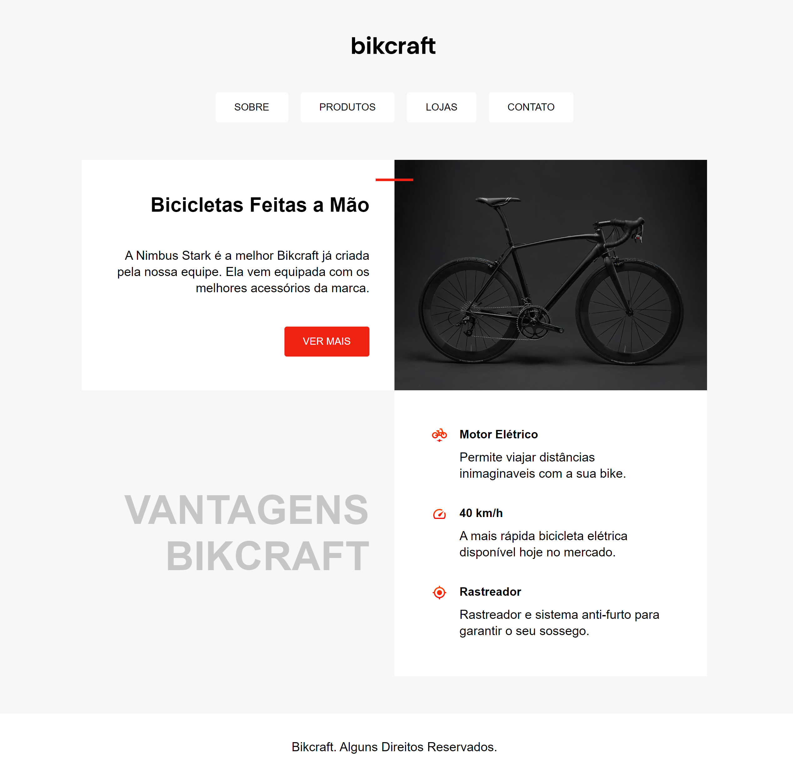

## 🎨 Layout

 

  

## 💻 Projeto

Ver. 0.0.1: Nesse projeto foi utilizado os conceitos de Positions que foi estudado no curso do Origamid.

Ver. 0.0.2: Usado conceitos de refatoração, pseudo classes e elementos, tipografia e unidades.

Ver. 0.0.3: Criado a responsividade no site adaptando mobile, tablet e computador.

 

## 🚀 Tecnologias

As seguintes ferramentas foram usadas na construção do projeto: 

- HTML
- CSS

 

## 📝 Licença

Este projeto está sobe a licença MIT.
